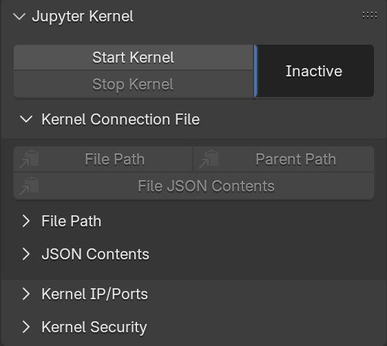
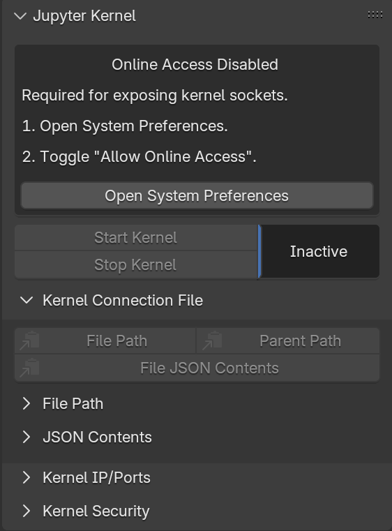

!!! abstract
	Get going with `bpy_jupyter`!

	**Need to install `bpy_jupyter`?** See [Installation](../installation.md).

# Getting Started
!!! warning "Warning: `uv` Required"
	It is **strongly suggested** to install [`uv`](https://docs.astral.sh/uv/) before following this guide, using the [`uv` installation guide](https://docs.astral.sh/uv/getting-started/installation/).

	`uv` ships with the `uvx` command, which makes it easy to run Python program without prior installation:

	```bash
	$ uvx ruff
	Ruff: An extremely fast Python linter and code formatter.

	Usage: ruff [OPTIONS] <COMMAND>
	...
	```

	_If you don't want to use `uv`, feel free to substitute `uvx <command>` for your preferred method of running `<command>`._

## Starting a Jupyter Kernel
After installing the extension, navigate to `Properties -> Scene`:

{ loading=lazy, width=300 }
/// caption
Default Extension Panel
///

To run the kernel, follow these steps:

1. Press the `Start Kernel` button.
2. Press the `Kernel Connection File -> (Copy) File Path` button.

That's it!
You can now use `jupyer-console` to connect to Blender's running kernel, simply by pasting the connection file path after `--existing`:
<!-- termynal -->
```bash
$ uvx jupyter-console --existing path/to/connection.json
Jupyter console 6.6.3

Python 3.11.9 (main, Sep 11 2024, 06:43:20) [GCC 11.2.1 20220127 (Red Hat 11.2.1-9)]
Type 'copyright', 'credits' or 'license' for more information
IPython 9.2.0 -- An enhanced Interactive Python. Type '?' for help.
Tip: Use `ipython --help-all | less` to view all the IPython configuration options.

In [1]:
```

!!! warning "Warning: `bpy_jupyter` Requires Online Access"
	{ loading=lazy, width=300, align=right }
	
	If your panel looks like this, then your distribution of Blender doesn't (currently) allow online access!
	
	A running Jupyter kernel creates and listens to network ports, which may be accessible from unexpected places.
	Anybody capable of connecting to these ports may also capable of _arbitrary code execution_ on your computer.

	For this reason, `Preferences -> System -> Allow Online Access` must be checked in order to start a Jupyter kernel.

!!! danger
	**Always check** your OS / firewall settings before starting a kernel.
	Failure to correctly prohibit external connections to kernel ports may allow an attacker to execute arbitrary code on your computer.

	It is the responsibility of your system administrator to prevent malicious third-parties from being able to access the network ports opened by `bpy_jupyter`.


### Using a Jupyter Kernel

!!! warning "Under Construction"
	This section is incomplete.

	For now, we suggest browsing the [`bpy` Gallery](https://kolibril13.github.io/bpy-gallery/).

At this point, one may `import bpy` and enjoy the full power of Blender's Python API.
To illustrate this, several concrete examples follow!

!!! example "Example: Moving the Default Cube"
	The first thing you might want to try is moving the default cube!
	```ipython
	In [1]: import bpy

	In [2]: bpy.context.object
	Out[2]: bpy.data.objects['Cube']

	In [3]: bpy.context.object.location.z
	Out[3]: 0.0

	In [4]: bpy.context.object.location.z = 2  ## You should see this in Blender!

	In [5]: bpy.context.object.location.z
	Out[5]: 2.0
	```

!!! reference
	For more examples, see the [`bpy` Gallery](https://kolibril13.github.io/bpy-gallery/).
